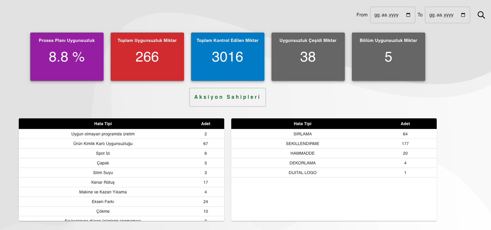

# Bonna Production Process Web Application

#### About Project : 
##### Production process data is recorded and detailed report results are obtained.
##### In the project, integration was made with the ERP (Enterprise Resource Planning) application.
##### User login operations are provided through ERP integration. To log in, you must have a user registration through the ERP system.
##### The data recorded in the application is kept in the Firebase database.
##### The project was deployed on docker as on premise.
##### The project was made with react and material UI was used.

## Installation

Install Bonna_cy_process_app

```bash
  npm install Bonna_cy_process_app
  cd Bonna_cy_process_app/current_version folder
  npm install node_modules
  npm start or yarn start or pnpm dev&start
```

## Images





